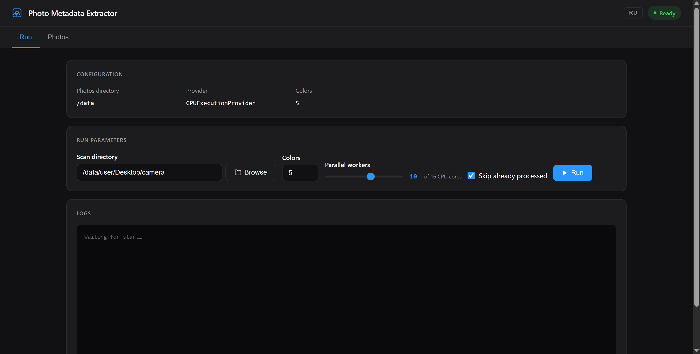
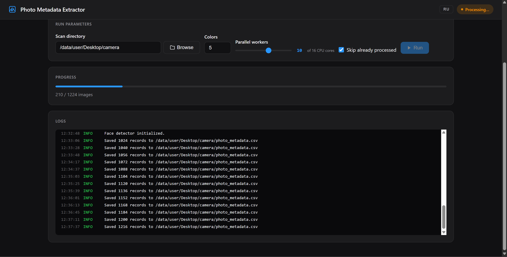
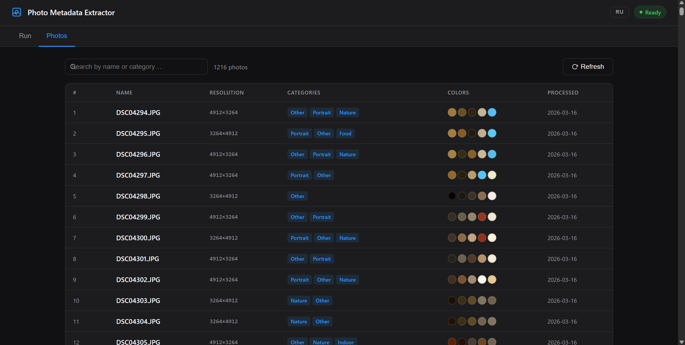
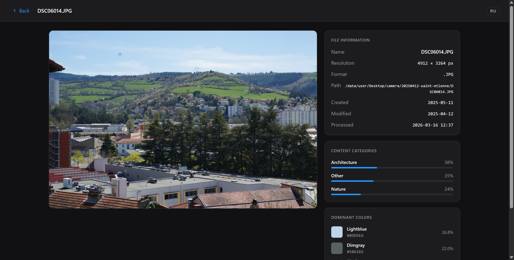

# Photo Metadata Extractor — Примеры работы

Визуальный обзор приложения в действии.

---

## 1. Вкладка «Запуск» — готов к работе

Вкладка **Запуск** отображает текущую конфигурацию и позволяет выбрать директорию, задать количество извлекаемых цветов, настроить число параллельных потоков и начать обработку.

В этом примере:
- Директория сканирования: `/data/user/Desktop/camera`
- 5 доминирующих цветов на фотографию
- 10 параллельных потоков из 16 доступных ядер CPU
- **Пропустить обработанные** — отмечено: будут обработаны только новые или изменённые фото

---

## 2. Обработка в процессе

После нажатия **Запустить** появляется прогресс-бар и живые логи из конвейера обработки.

Индикатор статуса в правом верхнем углу переключается в режим **Processing…**. Прогресс-бар показывает, сколько фотографий уже обработано (210 из 1224 в данном примере). Панель логов выводит данные в реальном времени — видно, как пакеты записываются в CSV-файл.

---

## 3. Вкладка «Фотографии» — таблица результатов

После завершения обработки перейдите на вкладку **Фотографии**, чтобы просмотреть результаты.

Таблица отображает все 1216 обработанных фотографий с:
- **Разрешением** (например, 4912×3264)
- **Категориями**, обнаруженными ИИ (Портрет, Природа, Еда, Помещение, Другое…)
- **Цветами** — маленькие образцы доминирующих цветов, извлечённых из каждой фотографии
- Датой **Обработки**

Используйте строку поиска для фильтрации по имени файла или названию категории.

---

## 4. Страница деталей фотографии

Нажмите на любую строку, чтобы открыть полную страницу с информацией о фотографии.

На странице деталей отображается:
- Сама фотография слева
- **Информация о файле** — название, разрешение, формат, полный путь, даты создания/изменения/обработки
- **Категории контента** с полосами уверенности (Архитектура 38%, Другое 35%, Природа 24% в данном примере)
- **Доминирующие цвета** с HEX-кодами и процентом площади изображения (Lightblue 26.9%, Dimgray 22.0%)
